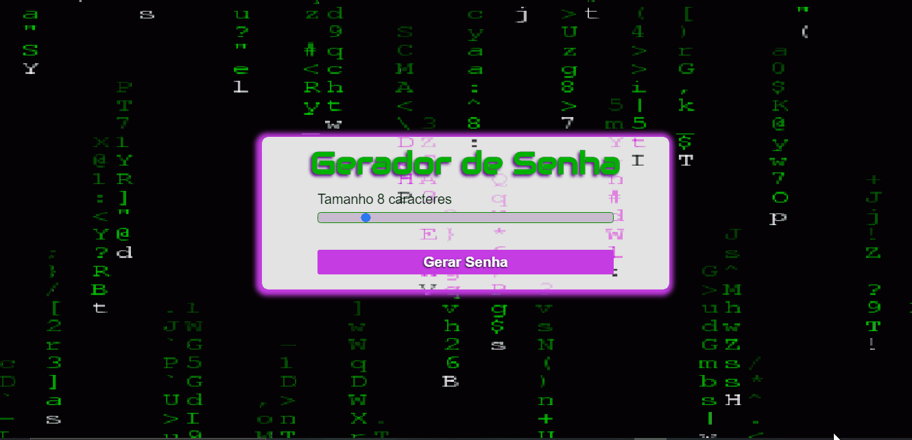

<h1 align="center">Gerador de senha</h1>

Este programa gera senhas de tamanhos diversos, conforme a necessidade do usuário.

<h1 align="center">
  
</h1>

---
### Tecnológias

As seguintes ferramentas foram usadas na construção do projeto:

---
### 💻 Demostração:

---

### Fontes e sites utilizados durante o projeto

<ul>
    <li><a href="https:https://developer.mozilla.org/en-US/docs/Web/API/GlobalEventHandlers/oninput" target="_blank">.oninput</a>
    <li><a href="https://developer.mozilla.org/pt-BR/docs/Web/JavaScript/Reference/Global_Objects/String/charAt" target="_blank">método charAt</a>
    <li><a href="https://www.w3schools.com/css/css3_transitions.asp" target="_blank">Transições CSS</a>
</ul>

<h2>👩🏽‍💻 Autor:</h2>
 

<h3>Rafael Alves</h3>

Projeto realizado por Rafael Alves Teixeira

